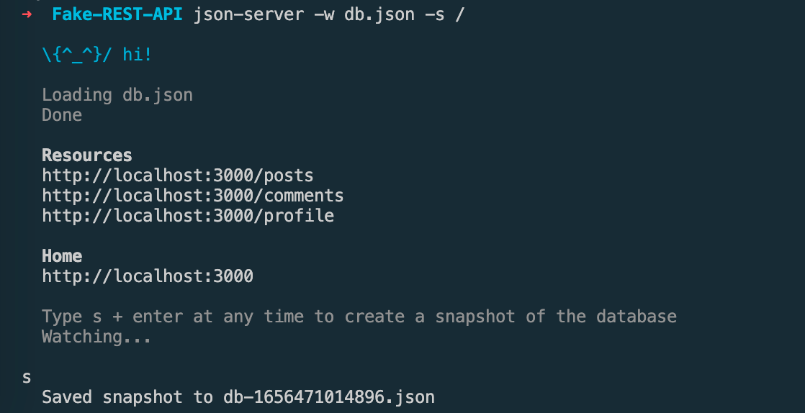
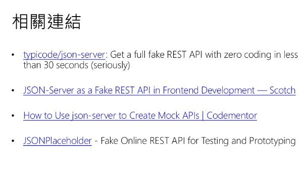
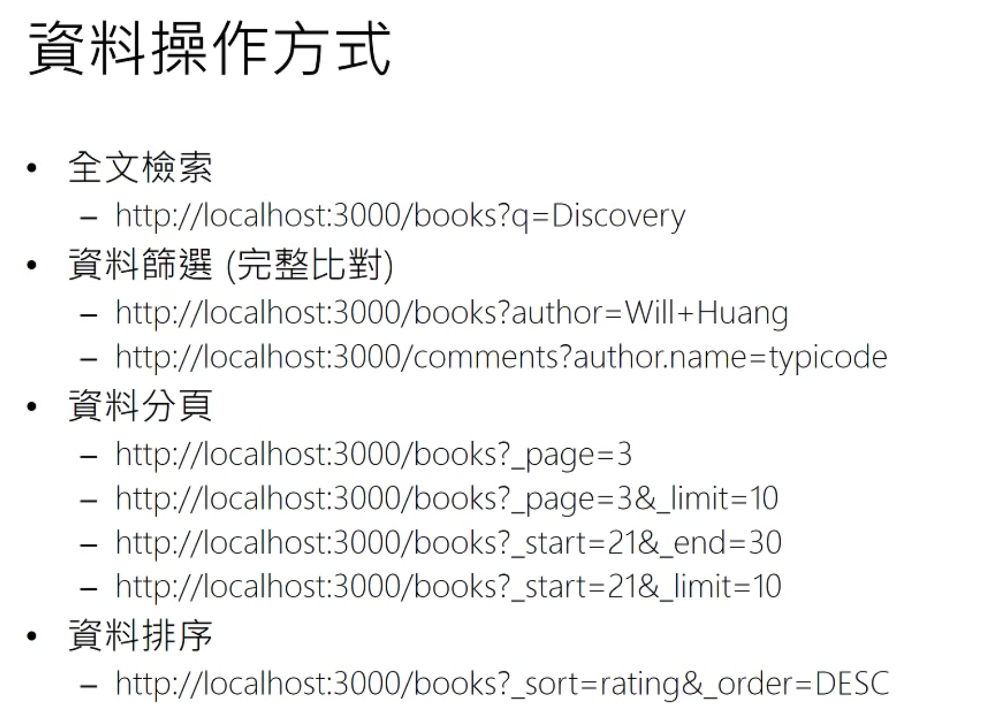
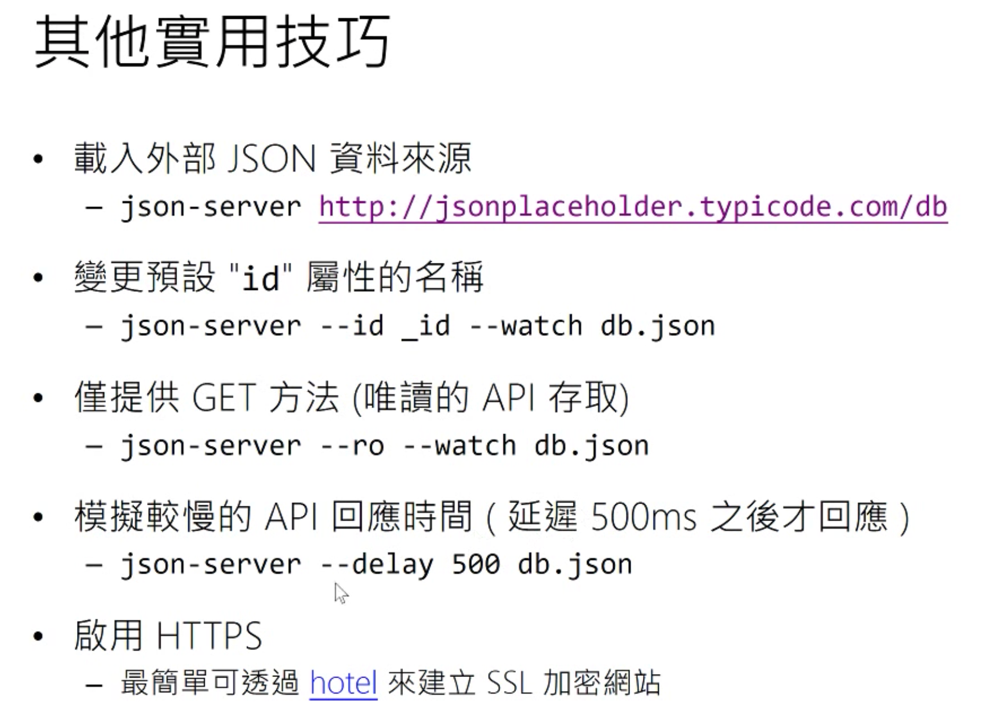

---
layout: cover
highlighter: prism
info: |

---


# JSON - Server

快速搭建一个 Fake REST API
我是一个文档

---
layout: center
class: text-center

---


# 快速开始

Quick Start


---
layout: big-bullets
heading: 安装
subheading: Install

---

1. 安装

   ```bash
   npm install -g json-server
   ```

2. 启动服务

   ```bash
   json-server --watch db.json
   ```

   >  执行这个命令会自动在当前目录下创建 `db.json`文件

3. 测试API

   http://localhost:3000/


---
layout: big-bullets
heading: API接口请求方式

---


## API接口请求方式

- GET - 请求数据
- POST - 添加数据
- DELETE - 删除数据
- PUT - 修改数据(完整)
- PATCH - 修改数据(部分)

---


## 注意事项

- POST、PUT 或 PATCH 请求应包含Content-Type: application/json在请求正文中使用 JSON 的标头。否则它将返回 2XX 状态代码，但不会对数据进行更改。
- 如果您发出 POST、PUT、PATCH 或 DELETE 请求，更改将自动安全地保存到 `db.json`。
- Id 值是不可变的。除了在 POST 请求，在PUT 或 PATCH 请求正文中的任何id值都将被忽略。

> Tip：
> 终端中输入 `s` 然后按下 `Enter` 就可以存储当前数据库快照。

<div v-click class="absolute bottom-8 w-full">
  
</div>

---
layout: center
class: text-center

---


# 进阶技巧

Advanced Tips


---


## 网页服务器

- 建立 `public` 文件夹，将静态网页文件放入，就可以运行一个本地服务。

  - 创建一个 index.html

- 你也可以指定静态网页路径运行服务
  ```bash
  json-server -w db.json -s /
  ```

- 指定端口
  ```bash
  json -server --watch db.json --port 3004
  ```

---


## REST API 搜索、分页

<div class="grid grid-cols-[90px,350px,1fr] gap-x-2"> <div />

###### 请求

###### 描述

<v-clicks :every='3'>

<div class="my-auto leading-6 text-base opacity-75">
全文搜索
</div>

```bash
GET /posts?q=internet
```

> 查询含有 'internet' 的posts。

<div class="my-auto leading-6 text-base opacity-75">
分页
</div>

```bash
GET /posts?_page=7
GET /posts?_page=7&_limit=20
```

> 使用`_page`和可选地`_limit`对返回的数据进行分页。

<div class="my-auto leading-6 text-base opacity-75">
筛选
</div>

```bash
GET /posts?title=json-server&author=typicode
GET /posts?id=1&id=2
GET /comments?author.name=typicode
```

> 。。。

<div class="my-auto leading-6 text-base opacity-75">
排序
</div>

```bash
GET /posts?_sort=views&_order=asc
GET /posts/1/comments?_sort=votes&_order=asc
```

> 添加`_sort`和`_order`（默认升序）

</v-clicks>

</div>

---


## 进阶搜索

- 添加`_gte`或`_lte`获取范围

```bash
GET /posts?views_gte=10&views_lte=20
```

- 添加`_ne`以排除值

```bash
GET /posts?id_ne=1
```

- 添加`_like`到过滤器（支持正则表达式）

```bash
GET /posts?title_like=server
```

---


## 自定义API路由

- 创建路由定义文件 `routes.json`

  ```json
  {
    "/api/*": "/$1",
    "/:resource/:id/show": "/:resource/:id",
    "/posts/:category": "/posts?category=:category",
    "/articles\\?id=:id": "/posts/:id"
  }

  ```

- Start JSON Server with `--routes` option。

  ```bash
  json-server db.json --routes routes.json
  ```

- 现在可以使用我们定义好的路由访问接口：

  ```bash
  /api/posts # → /posts
  /api/posts/1  # → /posts/1
  /posts/1/show # → /posts/1
  /posts/javascript # → /posts?category=javascript
  /articles?id=1 # → /posts/1
  ```

---
layout: center
class: text-center

---


# 其它技巧

Other skills

---

- 远端数据

  ```bash
  json-server http://example.com/file.json
  json-server http://jsonplaceholder.typicode.com/db
  ```

- 设置数据库 id 属性
  ```bash
  json-server --id _id --watch db.json
  ```

- 只提供 GET 方法 （只读API）

  ```bash
  json-server --read-only --watch db.json
  ```

- 模拟网络较慢的API回应时间 (延迟 500ms)

  ```bash
  json-server --delay 500 db.json
  ```

- 启用 HTTPS

  - 在开发中设置 SSL 的方法有很多。一种简单的方法是使用[hotel](https://github.com/typicode/hotel)。

---


# 相关连接 （ 以下等待整理）

- [JSON-Server as a Fake REST API in Frontend Development](https://www.digitalocean.com/community/tutorials/json-server-as-a-fake-rest-api-in-frontend-development)

- [JSONPlaceholder - Live running version](https://jsonplaceholder.typicode.com/)

- [JSON Server NPM](https://www.npmjs.com/package/json-server)


SEATCH KEY:

```BASH
HOW TO USE JSON-SERVER TO CREATE MOCK APIS
```





[豆瓣API](https://github.com/iiiiiii1/douban-imdb-api/blob/master/old-api.md)

[jsonplaceholder](http://jsonplaceholder.typicode.com/)

## Fake Online REST server for teams
https://my-json-server.typicode.com/

## 注意事项
在对数据库进行增删改查操作之后, 可以在终端输入 `s` 然后 `Enter` 保存当前数据的快照。


## 接口查询

全文检索







## 参考资料
- [json-server NPM](https://www.npmjs.com/package/json-server)
- [2017-05-30 (直播錄影) 進擊的前端工程師：今天就自己打造 API 吧！ (高清版)](https://www.youtube.com/watch?v=uFKa4xrc42c&list=PLS5TEdsAHNZgxvT0_2j-rcK0jUDnHy2i4&index=5&t=366s)
- [使用 JSON Server 快速建置 Fake REST API 服務](https://www.slideshare.net/WillHuangTW/use-json-server-as-a-fake-rest-api)
- [程序员用的PPT - Slidev](https://github.com/slidevjs/slidev)
- [reveal.js](https://github.com/hakimel/reveal.js)
- [stackblitz](https://stackblitz.com/)